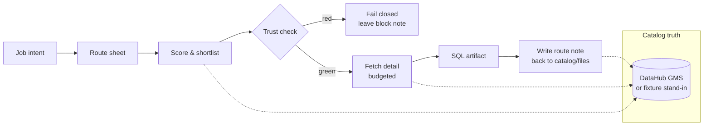

<p align="center">
  
</p>

<p align="center">
  <strong>Light only the trusted catalog assets for a data job — then leave the route behind.</strong>
</p>

<p align="center">
  <a href="https://github.com/SeraKah-1/known-path/blob/main/LICENSE"></a>
  <a href="https://www.python.org/downloads/"></a>
  <a href="https://datahub.devpost.com"></a>
  <a href="https://datahubproject.io"></a>
  <a href="https://modelcontextprotocol.io"></a>
  
</p>

<p align="center">
  <a href="#quickstart">Quickstart</a> ·
  <a href="#how-it-works">How it works</a> ·
  <a href="#demo">Demo</a> ·
  <a href="#mcp--agents">MCP &amp; agents</a> ·
  <a href="#hackathon">Hackathon</a> ·
  <a href="docs/HACKATHON.md">Compliance</a>
</p>

---

## Why this exists

Data catalogs already know which table is **canonical**, which is **deprecated**, and who **owns** it.  
Agents still thrash search and join the wrong `revenue_*` table.

**known-path** is a small activation layer on top of that catalog truth:

1. Load a short **route sheet** for the job  
2. **Light** only the few assets that matter  
3. **Stop** if trust is red (no invented replacements)  
4. Emit **SQL you could open a PR with**  
5. **Write a route note** so the next run starts smarter  

Built for the [**DataHub Agent Hackathon**](https://datahub.devpost.com) — tracks *Metadata-Aware Code Generation* and *Agents That Do Real Work*.

<p align="center">
  
</p>

---

## How it works



| Mode | Behavior |
|------|----------|
| **baseline** | Naive name thrash — more fetches, often lights `finance.revenue_old` |
| **known-path** | Route sheet + trust — lights canonical + region only |
| **blocked** | Forces red trust — **stops**, does not invent a table |

This is **not** a second catalog, not a lineage UI, and not “dump all metadata into the prompt.”

---

## Quickstart

```bash
git clone https://github.com/SeraKah-1/known-path.git
cd known-path
python -m venv .venv && source .venv/bin/activate   # Windows: .venv\Scripts\activate
pip install -e ".[dev]"

kp doctor
kp demo
```

Artifacts land in:

```text
examples/baseline_wrong.sql
examples/revenue_by_region.sql
examples/runs/last_*.json
examples/runs/writeback_route_note.md
```

### Optional live DataHub

```bash
export DATAHUB_GMS_URL=http://localhost:8080
export DATAHUB_GMS_TOKEN=your_token
kp doctor
```

See also: [DataHub Quickstart](https://docs.datahub.com/docs/quickstart) · [DataHub MCP](https://docs.datahub.com/docs/features/feature-guides/mcp) · [DataHub Skills](https://docs.datahub.com/docs/dev-guides/agent-context/skills)

### Web demo (optional)

```bash
pip install -e ".[web]"
uvicorn apps.web.app:app --host 0.0.0.0 --port 8088
# open http://127.0.0.1:8088
```

---

## Demo

```bash
kp demo
```

Expected story:

| Step | Result |
|------|--------|
| Baseline | Higher fetch count; trap table can activate |
| Known path | `finance.revenue_canonical` + `dim.region`; fewer fetches |
| Blocked | Status `BLOCKED_TRUST`; no SQL invention |

```bash
kp run --mode baseline  -i "revenue by region last quarter"
kp run --mode known-path -i "revenue by region last quarter"
kp run --mode blocked   -i "revenue by region last quarter"
```

Sample SQL (generated):

```sql
-- known-path generated SQL
-- job: job.revenue_by_region_quarter
-- fact_urn: urn:li:dataset:(urn:li:dataPlatform:snowflake,finance.revenue_canonical,PROD)
SELECT
  d.region_name AS region,
  SUM(f.revenue_amount) AS revenue
FROM finance.revenue_canonical AS f
JOIN dim.region AS d
  ON f.region_id = d.region_id
...
```

---

## MCP & agents

Install MCP extra and run the server:

```bash
pip install -e ".[mcp]"
python -m known_path.mcp_server
```

**Tools:** `match_job` · `activate` · `ping_required` · `commit_route` · `explain_last_run`

**Skill package:** [`skills/known-path/SKILL.md`](skills/known-path/SKILL.md) — workflow instructions agents load on demand (pairs with tools, does not replace them).

Example Cursor / Claude MCP snippet:

```json
{
  "mcpServers": {
    "known-path": {
      "command": "python",
      "args": ["-m", "known_path.mcp_server"],
      "cwd": "/path/to/known-path"
    }
  }
}
```

---

## Project layout

```text
known-path/
├── assets/                 # logo + diagrams
├── cards/                  # route sheets (YAML)
├── docs/HACKATHON.md       # Devpost compliance map
├── examples/               # SQL + run records
├── skills/known-path/      # agent skill
├── src/known_path/         # library + CLI + MCP
├── apps/web/               # thin demo UI
└── tests/                  # real scoring/activation tests
```

---

## Hackathon

| | |
|--|--|
| Event | [datahub.devpost.com](https://datahub.devpost.com) |
| Compliance | [docs/HACKATHON.md](docs/HACKATHON.md) |
| License | [Apache-2.0](LICENSE) |
| Video script | [docs/demo-script.md](docs/demo-script.md) |

**Remaining human step:** record the &lt;3 minute YouTube/Vimeo video and complete the Devpost form (not automated here).

---

## Development

```bash
pip install -e ".[dev]"
pytest -q
```

Core policy lives in pure functions (`scoring.py`, `ping.py`, `activate.py`) so tests exercise the real logic with trap-vs-trusted fixtures.

---

## Links

- [DataHub](https://datahubproject.io) · [Docs](https://docs.datahub.com) · [MCP guide](https://docs.datahub.com/docs/features/feature-guides/mcp)
- [Model Context Protocol](https://modelcontextprotocol.io)
- [Hackathon rules](https://datahub.devpost.com/rules) · [Resources](https://datahub.devpost.com/resources)

---

## License

Copyright 2026 SeraKah-1  
Licensed under the [Apache License, Version 2.0](LICENSE).
